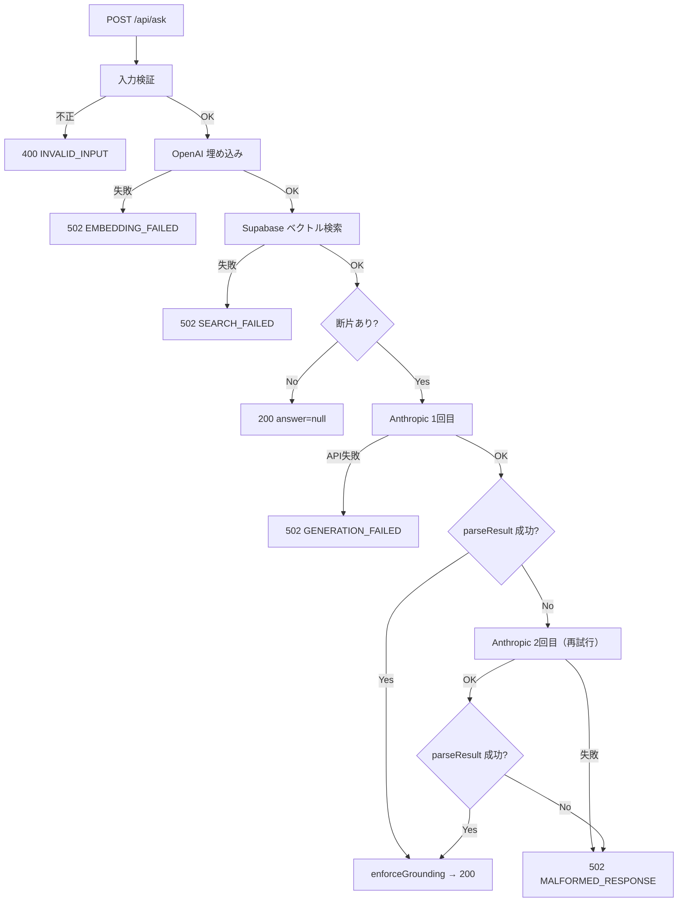

# 社内文書検索アシスタント（Phase 3 のサンプル）

**Phase 3（`3-1-1`〜`3-3-13`）で作る RAG アプリ（Lv2）の完成形サンプルです。**

- 作成日：2026-08-11 ／ **最終確認日：2026-09-04**
- 受講生の作業場所：`~/projects/docsearch-app`。**このサンプルを直接編集しないでください。**
- 一覧・共通ルール：[`../README.md`](../README.md)

> 教材本文では `samples/docsearch-app/` と書いています。このリポジトリでは `./docsearch-app/` が同じ位置づけです。

> ⚠️ **登場する会社・人物・数値はすべて架空です。**実在の団体とは関係ありません（Constitution 第12条）。
>
> ⚠️ **このディレクトリは運営用の完成形です。**受講生には、要件定義書と仕様書を**自分で書いてもらいます**（`3-1-2`）。ここにあるのは、書けたかどうかを照合するための見本です。

---

## ディレクトリ構成

リポジトリ直下の主要なパスです。`node_modules/`・`.next/`・`.env.local` は `.gitignore` 対象のため含めていません。

```
docsearch-app/
├── CLAUDE.md                 ← エージェント向けガードレール
├── PLANS.md                  ← 実装計画（T1〜T13）
├── README.md
├── .claude/
│   ├── settings.json         ← パーミッション（deny / ask / allow・npm はホスト直叩き禁止）＋ Hooks（整形の自動実行）
│   └── skills/               ← 自作 Skill（3-3-9・3-3-12）
│       ├── test-writer/SKILL.md     ← 観点表の行からテストを書く
│       └── verify-sources/SKILL.md  ← 質問セットで根拠の実在を確認
├── .devcontainer/
│   └── devcontainer.json     ← Dev Container（compose.yaml を参照。Claude Code は入れない）
├── .env.example              ← 環境変数テンプレート（4変数）
├── .gitignore
├── .dockerignore
├── Dockerfile
├── compose.yaml              ← Docker 実行（env_file: .env.local）
├── scripts/
│   ├── verify                ← 判定器の入口（コンテナ内で npm run verify）
│   ├── dev                   ← 開発サーバーの入口（docker compose up）
│   ├── install               ← 依存の再取得（人の承認後）
│   ├── ingest                ← 取り込みの入口（コンテナ内で npm run ingest。費用が出るため人が実行）
│   └── ingest.ts             ← 取り込みスクリプト本体（チャンク化・埋め込み・登録）
├── package.json              ← verify / ingest スクリプト
├── tsconfig.json
├── vitest.config.mts
├── app/
│   ├── api/ask/route.ts      ← POST /api/ask（サーバー側の入口）
│   ├── globals.css
│   ├── layout.tsx
│   └── page.tsx              ← 質問画面（3状態）
├── corpus/                   ← 検索対象文書（md 10・txt 20・pdf 5＝計35。現時点 pdf 未同梱）
│   └── README.md
├── docs/
│   ├── hearing.md            ← ヒアリング記録
│   ├── requirements.md       ← 要件定義書
│   ├── spec.md               ← 仕様書（F-1〜F-6）
│   ├── schema.sql            ← Supabase 側の定義（pgvector）
│   ├── persona-prompt.md     ← クライアント役ペルソナ
│   ├── reviewer-prompt.md    ← 敵役レビュアー
│   ├── adr/
│   │   ├── README.md
│   │   ├── ADR-001-検索方式の選定.md
│   │   ├── ADR-002-生成と埋め込みのプロバイダ.md
│   │   └── ADR-003-ベクトルストアの選定.md
│   ├── notes/
│   │   ├── cost-estimate.md
│   │   ├── eval-set.md
│   │   ├── external-services.md
│   │   └── query-limit.md
│   └── procedure/
│       ├── README.md         ← 実装手順書（逐次型）
│       └── implementation.md ← 一気通貫の実装ガイド
├── lib/
│   ├── ask.ts                ← 質問1回の処理（中核）
│   ├── chunk.ts              ← 文書分割
│   ├── clients.ts            ← 外部3サービスのインターフェース
│   ├── env.ts                ← assertEnv（起動時の4変数チェック）
│   ├── errors.ts             ← 失敗の分類と利用者向けメッセージ
│   ├── logger.ts             ← 構造化ログ
│   ├── prompt.ts             ← プロンプト・パース・enforceGrounding
│   ├── providers.ts          ← SDK 実装（テスト対象外）
│   ├── types.ts
│   ├── validate.ts           ← 入力検証
│   └── verify.ts             ← 根拠の実在チェック
└── tests/
    ├── fakes.ts              ← 外部サービスの偽物
    ├── integration/
    │   └── ask.test.ts
    └── unit/
        ├── chunk.test.ts
        ├── errors.test.ts
        ├── prompt.test.ts
        ├── validate.test.ts
        └── verify.test.ts
```

---

## ディレクトリ内のファイル一覧

| ファイル | 内容 | 対応する節 |
| --- | --- | --- |
| [docs/hearing.md](./docs/hearing.md) | ヒアリング記録。曖昧な依頼と、聞き返し12件 | `3-1-2` |
| [docs/requirements.md](./docs/requirements.md) | 要件定義書。何を・誰のために・なぜ | `3-1-2` |
| [docs/spec.md](./docs/spec.md) | 仕様書。**受け入れ基準 F-1〜F-6** | `3-1-2`（`2-2-4` の型を適用） |
| [docs/notes/external-services.md](./docs/notes/external-services.md) | 外部送信の一覧（クライアント提出物） | `3-1-2` |
| [docs/notes/cost-estimate.md](./docs/notes/cost-estimate.md) | 費用の見積もり | `3-3-11` |
| [docs/notes/query-limit.md](./docs/notes/query-limit.md) | 質問の上限・下限の根拠 | `3-1-2` |
| [docs/notes/eval-set.md](./docs/notes/eval-set.md) | 質問セット20問 | `3-3-8` |
| [docs/adr/](./docs/adr/) | ADR 3本（検索方式／プロバイダ／ベクトルストア） | `3-1-4` |
| [docs/persona-prompt.md](./docs/persona-prompt.md) | クライアント役の AI ペルソナ（配布物） | `3-1-2` |
| [docs/reviewer-prompt.md](./docs/reviewer-prompt.md) | 敵役レビュアー（配布物） | `3-1-3` |
| **[corpus/](./corpus/)** | **対象文書35ファイル**（Markdown 10・テキスト 20・PDF 5）。**現時点は PDF 5件未同梱**（md 10 + txt 20 = 30件） | `3-3-8` |
| [lib/](./lib/) | 実装（検証・分割・検索・生成・整形・失敗の分類） | `3-3-8` |
| [tests/](./tests/) | 単体テスト5本＋統合テスト1本（**48件**） | `3-3-9` |
| [scripts/ingest.ts](./scripts/ingest.ts) | 取り込みスクリプト（運用者が手元で実行） | `3-3-8` |
| [docs/schema.sql](./docs/schema.sql) | Supabase 側の定義（pgvector・近傍検索） | `3-3-8` |
| [app/](./app/) | 画面と Route Handler | `3-3-8`・`3-3-11` |
| `Dockerfile` / `compose.yaml` | 実行環境（決定 E28） | `3-3-11` |
| [CLAUDE.md](./CLAUDE.md) | コーディングエージェント向けガードレール（毎セッション自動読み込み） | `2-5-15` |
| [PLANS.md](./PLANS.md) | 実装計画（タスク T1〜T13・完了条件・リスク） | `2-3-7` |
| [.claude/settings.json](./.claude/settings.json) | パーミッション（`.env` の deny・`ingest` の ask など）＋ **Hooks**（編集後に prettier で整形） | `2-5-15`・`3-3-12` |
| [.claude/skills/test-writer/SKILL.md](./.claude/skills/test-writer/SKILL.md) | 観点表の行から単体・統合テストを書く Skill（`/test-writer`。**外部を呼ばない・出力の内容を assert しない**） | `3-3-9` |
| [.claude/skills/verify-sources/SKILL.md](./.claude/skills/verify-sources/SKILL.md) | 質問セット20問を回して**根拠の実在**を確認する Skill（`/verify-sources`。回答の内容は判定しない） | `3-3-12` |
| [.env.example](./.env.example) | 環境変数のテンプレート（4変数・値は書かない） | `2-4-11`・`3-3-11` |
| [docs/procedure/README.md](./docs/procedure/README.md) | **実装手順書（逐次型）。**部品ごとに指示する手順とプロンプト集 | `3-3-8`・`3-3-9` |
| [docs/procedure/implementation.md](./docs/procedure/implementation.md) | **一気通貫の実装ガイド。**1回の指示で完走させるためのリポジトリ設計 | `2-3-7`・`2-5-15` |

---

## 自動実行（Hooks）

`3-3-12` の 3-1 で入れた整形の自動実行が、`.claude/settings.json` に入っています（止め方まで書くのが渡せる状態の条件です・`3-3-12` 2-6）。

- 何が起きるか：Claude Code でファイルを編集すると prettier で整形されます
- 必要な道具：jq / prettier（`npm i -D prettier`。無ければ `npx` が取得します）
- 止め方：`.claude/settings.json` の `hooks` を消すか、`"disableAllHooks": true`

---

## エージェントコーディングを始めるときの整理

**実装セッションを始める前に、次の表で手順と前提を確認してください。**このリポジトリは完成形サンプルです。受講生がゼロから作る場合は、設計文書（要件・仕様・ADR・schema）を先に確定してから、エージェント向けの設定ファイルを揃えます。

### 始める前の前提（3点セット＋設計）

| # | そろえるもの | このリポジトリでの置き場所 | 無いまま始めると |
| --- | --- | --- | --- |
| 1 | **ガードレール**（外枠） | [CLAUDE.md](./CLAUDE.md)・[.claude/settings.json](./.claude/settings.json) | キー漏洩・費用の出る操作の自動実行・構成の選び直し |
| 2 | **仕様**（判断基準） | [docs/spec.md](./docs/spec.md)（F-1〜F-6） | 合否が決まらず、エージェントの質問が止まらない |
| 3 | **検証ループ**（収束） | `./scripts/verify`（コンテナ内で型チェック＋テスト48件） | 赤のまま積み上がる |
| 4 | **設計の固定**（Phase 3 追加） | [docs/adr/](./docs/adr/)（3本）・[docs/schema.sql](./docs/schema.sql) | 実装のたびにベクトル DB 等の選び直しが始まる |

> ⚠️ **仕様と ADR が無いまま「RAG アプリを作って」と指示しないでください。**
> 動くものは出てきますが、**合否と構成の根拠がファイルに無い**ため、セッションが止まるか、都度口頭で答えることになります（`2-3-6`）。

### 2つの進め方

| | [逐次型](./docs/procedure/README.md) | [一気通貫型](./docs/procedure/implementation.md) |
| --- | --- | --- |
| **向いている場面** | 初めて作る・型を学ぶ | 型が手に馴染んだあと・2回目以降 |
| **指示の回数** | 部品ごと（ステップ0〜13） | **1回**（起動プロンプト＋PLANS.md） |
| **エージェント設定** | ステップ0のガードレールを**毎回プロンプトで渡す** | [CLAUDE.md](./CLAUDE.md)・[PLANS.md](./PLANS.md)・[settings.json](./.claude/settings.json) を**先に置く** |
| **各ステップの終わり** | `./scripts/verify` | 同上（タスクごとに緑に戻してから次へ） |
| **詳細** | [docs/procedure/README.md](./docs/procedure/README.md) | [docs/procedure/implementation.md](./docs/procedure/implementation.md) |

**初回は逐次型を推奨します。**一気通貫は、逐次で1周して部品の境界が頭に入ってからのほうが、止まったときに切り分けられます。

### 実装開始前チェックリスト

実装（または再実装）に入る直前に、次を確認します。

| 順 | 確認すること | 確認方法 |
| --- | --- | --- |
| 1 | 受け入れ基準が確定している | [docs/spec.md](./docs/spec.md) の F-1〜F-6 を読める |
| 2 | 構成が ADR で固定されている | [docs/adr/](./docs/adr/) の3本がある |
| 3 | DB 定義がある | [docs/schema.sql](./docs/schema.sql) がある |
| 4 | ガードレールがファイルにある（一気通貫の場合） | [CLAUDE.md](./CLAUDE.md)・[.claude/settings.json](./.claude/settings.json) がある |
| 5 | 実行計画がある（一気通貫の場合） | [PLANS.md](./PLANS.md) のタスク・完了条件・リスクがある |
| 6 | 判定器が動く | `./scripts/verify` が緑（**API キー不要**） |
| 7 | 対象文書を触らない | `corpus/` は読み取り専用（エージェントに変更させない） |

**API キー（4変数）は実装ループには不要です。**テストは `tests/fakes.ts` で外部を呼ばずに完結します。キーが要るのは、人が行う**取り込み（`./scripts/ingest`）・手動確認・デプロイ**だけです（[docs/procedure/implementation.md](./docs/procedure/implementation.md) §8）。

### 一気通貫で始めるとき（起動プロンプト）

[PLANS.md](./PLANS.md) とガードレールがそろっていれば、セッションの最初の指示は次の1回で足ります。

```
PLANS.md に従って、T1 から T13 まで実装を進めてください。

- 各タスクの完了条件を満たし、./scripts/verify を緑にしてから次のタスクへ進むこと。
- タスクが終わるたびに PLANS.md のチェックを更新し、1タスク1コミットでコミットすること。
- CLAUDE.md の停止条件・「費用の出る操作」に当たったら、止めて報告すること。
- すべて終わったら、T13 の突き合わせ表と、未達・保留があればその一覧を報告すること。
```

自分のアプリで使うときは、[PLANS.md](./PLANS.md) のチェックをすべて外した状態から始めます。

### 人がやること・エージェントに任せないこと

| 場面 | 誰がやるか | 理由 |
| --- | --- | --- |
| `.env.local` の作成（4つの API キー） | **人** | `settings.json` が `.env` の読み取りを deny。指示するとキーが会話ログに残る |
| `./scripts/ingest` の実行 | **人** | 埋め込み API を呼び、費用が出る。`ask` に登録されている |
| `./scripts/install` 等の依存追加 | **人が承認** | `ask` に登録されている |
| 仕様に無い判断への回答 | **人**（spec.md に追記してから再開） | 決定を会話ログだけに残さない（`2-3-6`） |
| 実装・テスト・verify のループ | **エージェント** | 判定器はキー無し・0円で回る |

環境変数の設定手順は [docs/procedure/implementation.md §8](./docs/procedure/implementation.md) を参照してください。

---

## 実装での重要な観点

| 観点 | 状態 |
| --- | --- |
| **キーはサーバー側だけ** | `app/api/ask/route.ts` が `lib/providers.ts` を呼ぶ。`app/page.tsx` からは触れない（第13条7） |
| **外部を呼ばずにテストできる** | `lib/clients.ts` のインターフェースを `tests/fakes.ts` で差し替える |
| **入力で弾けば費用が出ない** | 統合テストが「短すぎる質問では外部の呼び出し回数が0」を確かめている |
| **根拠の実在は機械で判定できる** | `lib/verify.ts`。要約された抜粋は不合格になる（F-2 合格条件④） |
| **根拠が無ければ答えを作らない** | `lib/prompt.ts` の `enforceGrounding`。断片0件なら生成を呼ばない（F-3） |
| **形式の崩れは1回だけ再試行** | `lib/ask.ts`。同じプロンプトなら同じように壊れるため、それ以上は繰り返さない |
| **ログに質問文と回答本文を入れられない** | `lib/logger.ts` の `AskLog` に欄が無い。書こうとすると型で落ちる（F-6） |
| **LLM の出力の内容を assert しない** | `tests/` に出力の文面を期待値にしたテストが1件も無い（第13条1） |

### 検証の状況

| 項目 | 状態 |
| --- | --- |
| **単体・統合テスト** | **48件すべて通過**（2026-09-04 確認。`vitest` のみをこのディレクトリに入れて実行） |
| テストが外部を呼んでいないこと | `tests/` から `lib/providers.ts` と各 SDK を import していないことを確認済み |
| 型チェック | `lib/providers.ts` を除く10ファイルで型エラー0。**`providers.ts` は SDK の型が要るため未実施** |
| **コンテナの起動確認** | **未実施。**Phase 2 の `minutes-app` と同じ理由（決定 E28） |
| **Supabase・各 API への実接続** | **未実施。**外部サービスを実際には呼んでいない |

> ⚠️ **「テストが通った」は「動く」ではありません。**
> 外部サービスに実際に接続した確認は行っていません。`3-3-9` で扱った「守れない範囲」がここにも当てはまります。

---

## 質問1回の処理（アプリの挙動）

利用者が画面で質問を送ってから回答またはエラーが返るまでの流れです。中核は [`lib/ask.ts`](./lib/ask.ts) です。

### 全体の流れ

| 段階 | 処理 | 実装 | 外部 API |
| --- | --- | --- | --- |
| 1 | 入力検証 | [`lib/validate.ts`](./lib/validate.ts) | 呼ばない |
| 2 | 質問の埋め込み | [`lib/providers.ts`](./lib/providers.ts) | OpenAI |
| 3 | ベクトル検索 | 同上（Supabase `match_chunks`） | Supabase |
| 4 | プロンプト組み立て | [`lib/prompt.ts`](./lib/prompt.ts) `buildPrompt` | 呼ばない |
| 5 | 回答生成 | 同上（Anthropic） | Anthropic |
| 6 | JSON パース・整形 | [`lib/prompt.ts`](./lib/prompt.ts) `parseResult` / `enforceGrounding` | 呼ばない |

**1 で弾ければ、外部 API は1回も呼ばれません**（費用が出ない）。

入口は [`app/api/ask/route.ts`](./app/api/ask/route.ts)（`POST /api/ask`）です。画面 [`app/page.tsx`](./app/page.tsx) から `fetch` されます。

### 処理フロー図



> 図は上記 mermaid ブロックが正です。PNG や `.mmd` ソースが必要な場合は [`docs/ask-flow.mmd`](./docs/ask-flow.mmd) を新規作成し、`npx @mermaid-js/mermaid-cli -i docs/ask-flow.mmd -o docs/ask-flow.png -b white -w 1200` で生成してください（現時点では未同梱）。

### 期待される回答形式

生成プロンプト（[`lib/prompt.ts`](./lib/prompt.ts) `buildPrompt`）は、LLM に次の JSON **だけ**を返すよう指示します。

```json
{
  "answer": "文字列 または null",
  "sources": [
    { "document": "ファイル名", "excerpt": "抜粋そのまま" }
  ]
}
```

| フィールド | 型 | 意味 |
| --- | --- | --- |
| `answer` | `string` または `null` | 回答本文。抜粋から読み取れないときは `null` |
| `sources` | 配列 | 根拠として使った断片。最大3件（`MAX_SOURCES`） |
| `sources[].document` | 文字列 | 文書ファイル名 |
| `sources[].excerpt` | 文字列 | 抜粋の**そのまま写し**（要約しない） |

`parseResult` は **形式だけ**を見ます。回答の正しさは判定しません（第13条1）。

#### 形式不正と判定されるケース

| 条件 | 例 |
| --- | --- |
| JSON として読めない | `承知しました。回答は…`（説明文のみ） |
| オブジェクトでない | `"hello"` |
| `answer` が文字列でも `null` でもない | `{"answer": 42, "sources": []}` |
| `sources` が配列でない | `{"answer": null, "sources": "なし"}` |

いずれも [`lib/prompt.ts`](./lib/prompt.ts) が `MalformedResponseError` を投げます。Markdown のコードフェンス（` ```json ... ``` `）で囲まれていても読み取れます。

> **`sources` 配列の各要素が不正な場合はスキップ**されます（エラーにはなりません）。要素がすべて落ちると空配列になり、`enforceGrounding` により `answer` が `null` になります。

### 根拠が無いときの挙動（エラーではない）

| 状況 | HTTP | 画面 |
| --- | --- | --- |
| 検索結果が0件 | 200 | 「お答えできませんでした」 |
| JSON は正しいが `sources` が空 | 200 | 同上（`enforceGrounding` が `answer` を `null` にする） |

断片が0件のときは **生成 API を呼びません**（F-3・費用の節約）。

### 形式不正時のリトライとエラー

1回目のパース失敗時、**同じプロンプトで生成 API を1回だけ再呼び出し**します（[`lib/ask.ts`](./lib/ask.ts)）。

| 試行 | 結果 |
| --- | --- |
| 1回目でパース成功 | 200 で回答を返す |
| 1回目失敗 → 2回目成功 | 200 で回答を返す |
| 1回目失敗 → 2回目も失敗 | **502** + 「回答の形式が不正でした。もう一度お試しください。」 |

**2回以上は再試行しません。** 同じプロンプトなら同じように壊れやすいため、それ以上繰り返しても費用が増えるだけ、という設計です。

2回目の `catch` はパース失敗だけでなく **生成 API 自体の失敗** も含みます。その場合も同じ `MALFORMED_RESPONSE` になります。

このエラーが出た時点で、だいたい次の外部呼び出しが済んでいます。

| API | 呼び出し回数 |
| --- | --- |
| OpenAI（埋め込み） | 1回 |
| Supabase（検索） | 1回 |
| Anthropic（生成） | **最大2回** |

### エラーメッセージの生成

利用者向けの文言は [`lib/errors.ts`](./lib/errors.ts) `toAskError` で決まります。**内部情報（生 JSON・スタック・キー）は混ぜません。**

| コード | HTTP | 利用者へのメッセージ |
| --- | --- | --- |
| `INVALID_INPUT` | 400 | 質問の長さを確認してください。 |
| `EMBEDDING_FAILED` | 502 | 質問の処理に失敗しました。しばらく待ってからもう一度お試しください。 |
| `SEARCH_FAILED` | 502 | 文書の検索に失敗しました。しばらく待ってからもう一度お試しください。 |
| `GENERATION_FAILED` | 502 | 回答の作成に失敗しました。しばらく待ってからもう一度お試しください。 |
| `MALFORMED_RESPONSE` | 502 | **回答の形式が不正でした。もう一度お試しください。** |
| `INTERNAL` | 500 | 処理に失敗しました。時間をおいてお試しください。 |

失敗時は [`lib/logger.ts`](./lib/logger.ts) に `ask.failed` が記録されます（質問文・回答本文は入れない）。

### 画面への表示

[`app/page.tsx`](./app/page.tsx) は3状態（loading / done / error）を必ず作ります（`2-4-13`）。

| 状態 | 条件 | 表示 |
| --- | --- | --- |
| loading | 送信直後 | 「社内文書を検索しています…」 |
| done（回答あり） | 200 かつ `answer` が文字列 | 回答 + 根拠一覧 |
| done（答えられない） | 200 かつ `answer === null` | 「お答えできませんでした」+ ヒント |
| error | 4xx / 5xx | `body.error.message`（上表の文言）+ 「時間をおいてもう一度お試しください。」 |

HTTP エラー時は `res.ok` が false のとき `body.error.message` をそのまま表示します。利用者が「もう一度試す」には、フォームから再度質問を送ります（新しいリクエストとして最初から処理されます）。

---

## 文書の分け方

**受け入れ基準は `spec.md` にしか書きません。**他の文書からは参照するだけです。

```
hearing.md      聞いた内容そのもの        ── 根拠
    ↓
requirements.md 何を・誰のために・なぜ    ── クライアントと合意する文書
    ↓ 参照
spec.md         どうなったら合格か        ── 判定に使う文書（基準はここ1か所）
    ↑ 参照
notes/          測定・見積もり・提出物    ── 根拠
```

> **なぜ分けるか。**`2-3-6` で扱ったとおり、**基準が2か所にあると、食い違ったときにどちらが正か分からなくなります。**
> `requirements.md` はクライアントと合意する文書なので、実装の都合で書き換えたくありません。`spec.md` は実装・検証で毎日使います。**更新の頻度が違うものを混ぜません。**

---

## 技術構成

| 層 | 選定 | 決定の記録 |
| --- | --- | --- |
| 実行環境 | Vercel（Next.js App Router ＋ Functions） | [ADR-001](./docs/adr/ADR-001-検索方式の選定.md) |
| 生成 | Claude（Anthropic API） | [ADR-002](./docs/adr/ADR-002-生成と埋め込みのプロバイダ.md) |
| 埋め込み | OpenAI の埋め込み API | [ADR-002](./docs/adr/ADR-002-生成と埋め込みのプロバイダ.md) |
| ベクトル保存 | Supabase（PostgreSQL ＋ pgvector） | [ADR-003](./docs/adr/ADR-003-ベクトルストアの選定.md) |

> 📌 **埋め込みだけ Anthropic 以外を使います。**
> Anthropic は埋め込み API を提供していないためです。**本コースで「2つ目の API プロバイダ」を扱うのはここが初めて**で、`2-4-11` で学んだキー管理を2つ分やることになります。
>
> **なぜこの構成を選び、何を捨てたかは ADR に書きます**（`3-1-4`）。この README と `requirements.md` には「決まったこと」だけを書きます。

---

## 実行環境

**ローカルのグローバル環境を汚しません**（決定 E24・E28）。

Phase 2 の [`../minutes-app/`](../minutes-app/) と同じく、`Dockerfile`・`compose.yaml` と入口ラッパー `./scripts/*` を同梱しています。依存は名前付きボリュームに閉じ、ホストに `node_modules/` を作りません（Node.js もホストに不要）。

```bash
docker compose build   # 初回のみ（依存の取得を含む）
./scripts/verify       # 型チェック＋テスト（キー不要・モック完結）
./scripts/dev          # 開発サーバー起動 → http://localhost:3000
./scripts/ingest       # 取り込み（コンテナ内で npm run ingest -- corpus。費用が出るため人が実行）
```

- **Claude Code はホスト**で起動し、npm 系コマンドはラッパー経由で叩きます（`.claude/settings.json` は `Bash(npm *)` deny）
- **Dev Container（任意）**：Cursor / VS Code の「Reopen in Container」が [.devcontainer/devcontainer.json](./.devcontainer/devcontainer.json) 経由で同じ `compose.yaml` を使います

> **CI について**：このアプリには GitHub Actions の CI は**未設定**です（Phase 2 の [`minutes-app`](../minutes-app/) には [`.github/workflows/ci.yml`](../minutes-app/.github/workflows/ci.yml) あり）。ローカルでは `./scripts/verify` が判定器です。

環境変数は `.env.local` から読みます（`env_file` の `required: false`）。**キーはイメージに焼きません**（`2-4-11`・`3-3-11`）。

**コンテナの起動確認は未実施です**（決定 E28）。

---

## 配布するファイル

| | 配る | 理由 |
| --- | --- | --- |
| `docs/hearing.md` の**1回目まで** | ○ | `3-1-2` の演習の入口。曖昧な依頼から始めてもらう |
| `docs/hearing.md` の**聞き返し以降** | ⚪︎ | **これが演習の答え。**自分で質問を立ててもらう |
| `docs/requirements.md` / `docs/spec.md` | ✗ | 成果物そのもの。書いたあとの自己照合にだけ使う |
| [`corpus/`](./corpus/) の35ファイル | ○（**PDF 5件は未同梱**。追加後に配布） | 検索対象は運営が用意する |
| [`corpus/README.md`](./corpus/README.md) | 一部 | **どの質問がどの文書で引けるかの対応表は伏せる。**自分で測るのが `3-3-8` の演習 |
| `docs/notes/eval-set.md` の**質問20問** | 一部 | 答えられない5問の**型**は伏せる。自分で見つけるのが `3-3-8` の演習 |
