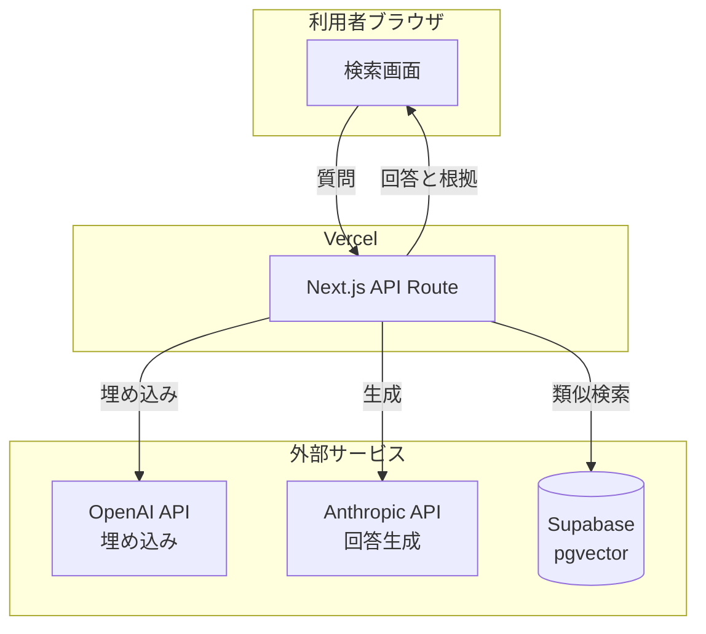
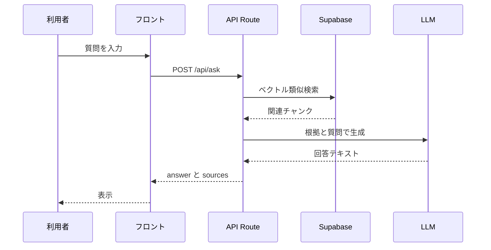
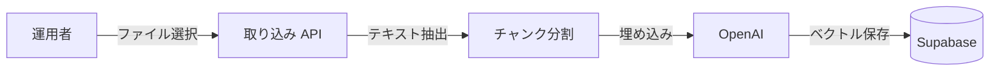
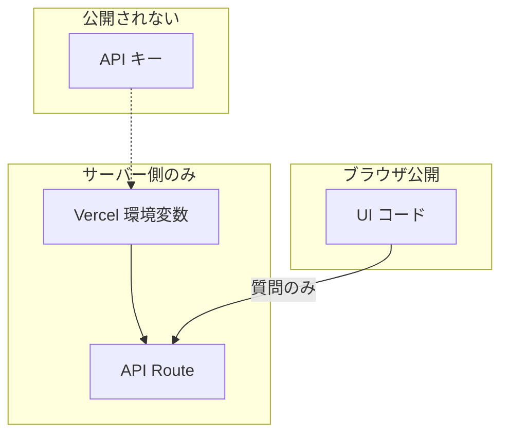
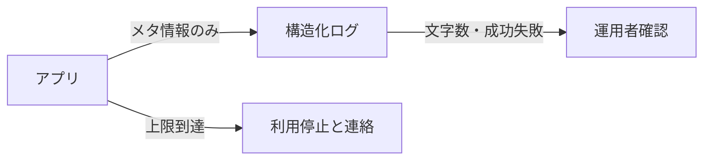

# 要件定義書 ── 社内文書検索アシスタント v1.0

> **この文書の位置づけ**：何を・なぜ作るかを書く要件定義書です。受け入れ基準（合否）は [spec.md](./spec.md) にのみ書きます。根拠や測定の記録は [notes/](./notes/) にあります。
>
> フォーマットは [`samples/references/要件定義書_フォーマット.md`](../../references/要件定義書_フォーマット.md) に準拠しています。
>
> ⚠️ **登場する会社・人物・数値はすべて架空です。**実在の団体・個人とは関係ありません（Constitution 第12条）。

| 項目 | 内容 |
| --- | --- |
| 版 | v1.0 |
| 最終更新 | 2026-08-09 |
| 根拠 | [hearing.md](./hearing.md)（2026-07-08 初回打ち合わせ） |

---

## 1. 概要（目的・背景）

### 1-1 目的

社内のルールに関する質問に、**対象文書を根拠として**答える Web アプリを作る。

### 1-2 背景

| 項目 | 内容 |
| --- | --- |
| クライアント | 株式会社テックバディ（製造業・社員約300名） |
| 困りごと | 共有フォルダ探索や Slack 質問に依存し、**総務部への聞き返し負荷**が増えている |
| 求める姿 | ファイル名の一覧ではなく**答えそのもの**が欲しい。回答には**根拠となった文書の提示**が必須 |
| 品質の考え方 | 精度100%は求めない。**根拠が無いときは「分からない」と返す**仕様で合意 |

---

## 2. ステークホルダー一覧

| 役割 | 担当 | 関与 |
| --- | --- | --- |
| 発注者・利用部門 | 佐藤 健一（総務部 部長） | 要件の優先順位・対象文書の選定 |
| 技術窓口 | 山本 美咲（情報システム部 リーダー） | 技術制約・運用・文書提供 |
| 受託側 | 高橋 翔太（エンジニア） | 設計・実装・説明資料 |
| 利用者 | 全社約300名 | 質問を入力し回答を読む |
| 運用者 | 総務部・情報システム部 | 対象文書の追加・再取り込み |

---

## 3. 機能要件／非機能要件

> **受け入れ基準（F-1〜F-5 の合否）は [spec.md](./spec.md) に書く。**ここでは「何を作るか」の一覧だけを置く。

### 3-1 機能要件

| ID | 機能 | 概要 |
| --- | --- | --- |
| F-1 | 質問入力 | 1行テキストで質問を送れる |
| F-2 | 回答表示 | 根拠つきの回答、または「分からない」を表示する |
| F-3 | 根拠表示 | 根拠となった文書名と抜粋を1〜3件示す |
| F-4 | 文書取り込み | 運用者が `.md` / `.txt` / `.pdf` を登録できる |
| F-5 | 利用上限 | 月間の利用回数・費用の上限に達したら止める |

### 3-2 非機能要件

| 区分 | 要件 |
| --- | --- |
| セキュリティ | API キーはサーバー側のみ。フロントに直書きしない |
| プライバシー | ログに質問本文・回答本文・個人情報を載せない |
| 可用性 | 初版は社内限定 URL で運用。ログイン・ロール管理は不要 |
| 費用 | 月数千円程度。超過前に相談。**上限設定**が必須 |
| 性能 | 1回の質問は**10秒以内**に結果を返す（目安） |
| 運用 | 文書更新は手動再取り込みで足りる（Drive 自動同期は初版不要） |

### 3-3 やらないこと（初版スコープ外）

| 項目 | 理由 |
| --- | --- |
| ログイン・ロール管理 | 社内限定 URL で足りる（初回合意） |
| Google ドライブ自動同期 | 手動再取り込みで運用開始 |
| Excel 連携 | 必須対象外。あれば望ましい |
| 給与関連フォルダ | **絶対に対象外**。対象は総務部が1件ずつ確認 |
| 議事録要約 | 別トラック（[minutes-app](../../minutes-app/)）で小さく試作 |
| 精度100%の保証 | 根拠が無いときは正直に返す設計 |

---

## 4. システム構成・外部連携

### 4-1 技術スタック

| レイヤー | 選定 | 根拠 |
| --- | --- | --- |
| フロント | Next.js（App Router）＋ React ＋ TypeScript | 教材スタックと一致 |
| ホスティング | Vercel | PaaS。サーバーレス API Route |
| 埋め込み | OpenAI `text-embedding-3-small` | [ADR-001](./adr/ADR-001-検索方式の選定.md) |
| 生成 | Anthropic Claude（Haiku 系） | [ADR-002](./adr/ADR-002-生成と埋め込みのプロバイダ.md) |
| ベクトル DB | Supabase（pgvector） | [ADR-003](./adr/ADR-003-ベクトルストアの選定.md) |

### 4-2 外部連携

| サービス | 用途 | 備考 |
| --- | --- | --- |
| OpenAI API | 文書のベクトル化（埋め込み） | 送信内容・保持期間は [notes/external-services.md](./notes/external-services.md) |
| Anthropic API | 質問への回答生成 | 同上 |
| Supabase | ベクトル検索・メタデータ保存 | リージョン・データ保持は契約時確認 |
| Vercel | ホスティング・環境変数 | API キーは Vercel の環境変数に置く |

### 4-3 対象データ

| 項目 | 内容 |
| --- | --- |
| 保管場所（元） | Google ドライブ共有フォルダ、GitHub（Markdown） |
| 取り込み形式 | `.md` / `.txt` / `.pdf`（テキストが埋まっているもの） |
| ファイル数 | 全体約200、**現役参照は30〜40**程度 |
| 利用頻度 | 1日20〜30回程度 |

---

## 5. システム構成図

> 作成手順は [`samples/references/システム構成図_作成手順.md`](../../references/システム構成図_作成手順.md) を参照。

### 5-1 全体構成

### 5-2 データフロー（質問〜回答）

### 5-3 文書取り込みフロー

### 5-4 セキュリティ境界

### 5-5 運用・監視

---

## 6. スケジュールとマイルストーン

| マイルストーン | 目標 | 内容 |
| --- | --- | --- |
| M1 要件確定 | 2026-07-15 | 初回ヒアリング反映・対象文書リスト確定 |
| M2 設計レビュー | 2026-07-22 | ADR・spec 確定・外部送信説明資料 |
| M3 α版 | 2026-08-05 | 社内10名で試用・フィードバック |
| M4 初版リリース | 2026-08-15 | 社内限定 URL 公開 |

> 日付は教材用の目安です。実プロジェクトではクライアントと再合意する。

---

## 7. バージョン履歴

| 版 | 日付 | 変更内容 | 担当 |
| --- | --- | --- | --- |
| v1.0 | 2026-08-09 | 初版。要件定義書フォーマットに準拠して再構成 | 教材チーム |

---

## 関連文書

| 文書 | 内容 |
| --- | --- |
| [spec.md](./spec.md) | 受け入れ基準（合否の判断基準） |
| [hearing.md](./hearing.md) | 初回打ち合わせの記録 |
| [notes/](./notes/) | 上限・費用・外部サービスの補足 |
| [adr/](./adr/) | アーキテクチャ決定記録 |
