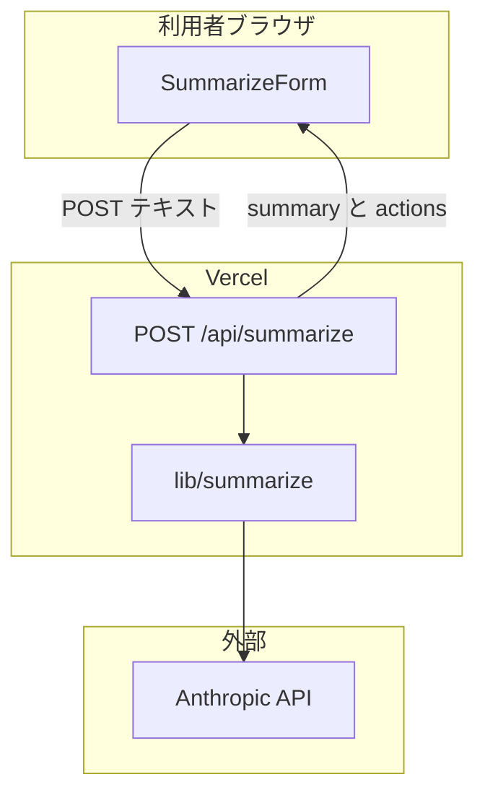
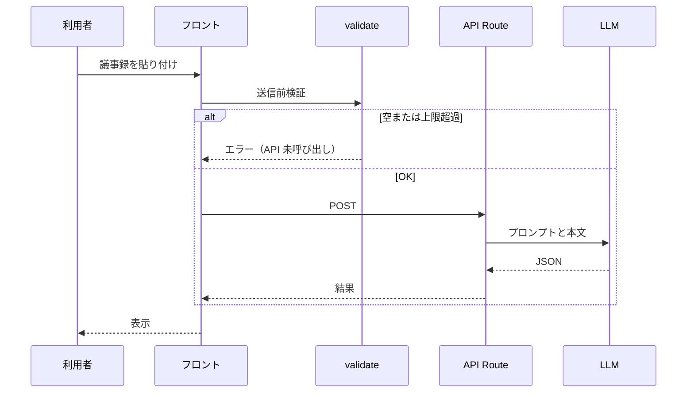
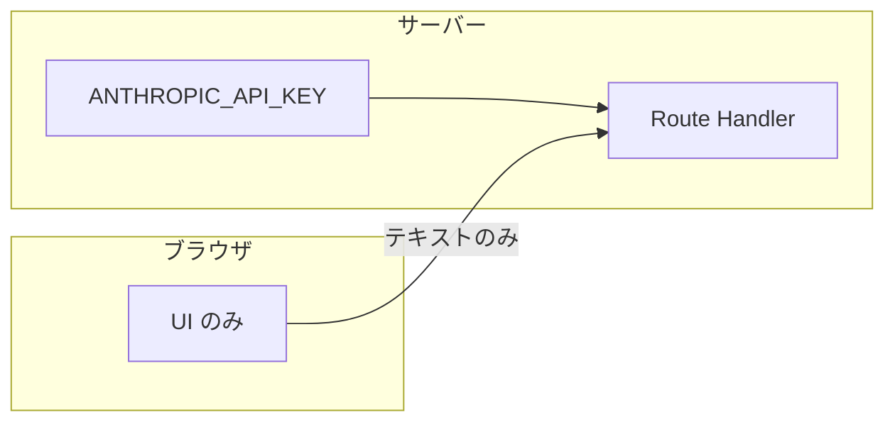
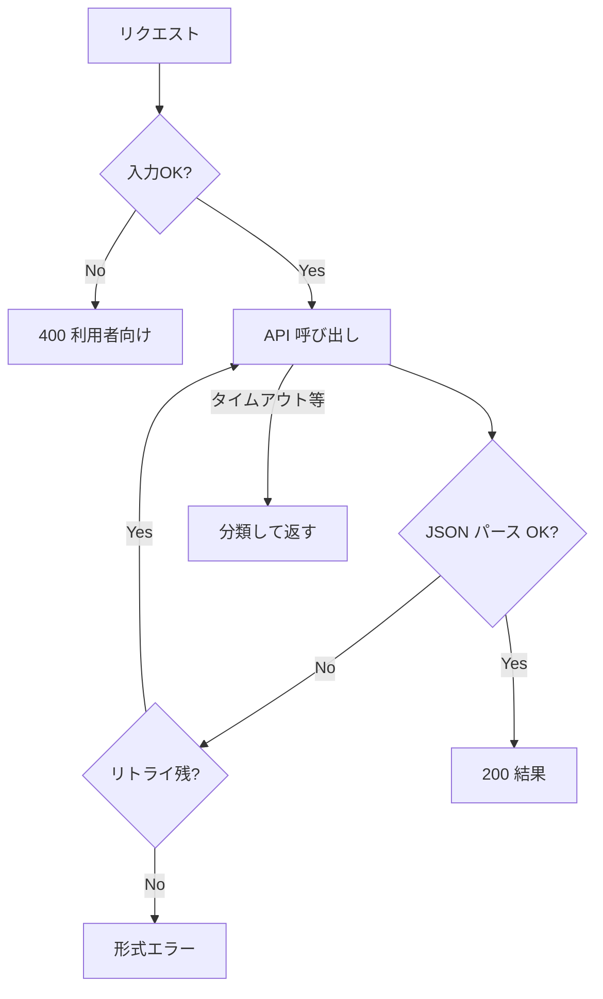
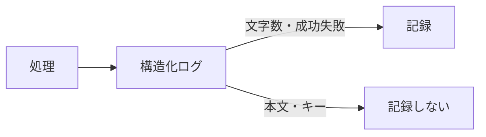

# 要件定義書 ── 議事録要約アプリ v1.0

> **この文書の位置づけ**：何を・なぜ作るかを書く要件定義書です。受け入れ基準（合否）は [spec.md](./spec.md) にのみ書きます。上限の根拠は [notes/input-limit.md](./notes/input-limit.md) にあります。
>
> フォーマットは [`samples/references/要件定義書_フォーマット.md`](../../references/要件定義書_フォーマット.md) に準拠しています。
>
> ⚠️ **登場する会社・人物・数値はすべて架空です。**実在の団体・個人とは関係ありません（Constitution 第12条）。

| 項目 | 内容 |
| --- | --- |
| 版 | v1.0 |
| 最終更新 | 2026-08-09 |
| 位置づけ | 社内文書検索の**別トラック**（Phase 2 教材サンプル） |

---

## 1. 概要（目的・背景）

### 1-1 目的

定例議事録を**貼り付けるだけ**で、決定事項とアクション項目（ToDo）を抽出する Web アプリを作る。

### 1-2 背景

| 項目 | 内容 |
| --- | --- |
| クライアント | 株式会社テックバディ（製造業・社員約300名） |
| 主案件 | [社内文書検索アシスタント](../../docsearch-app/) が優先 |
| 本アプリ | 初回打ち合わせで共有された**副次ニーズ**。余裕があれば小さく試作 |
| 困りごと | 定例議事録が長く、決定事項・ToDo の抽出に手間がかかる |
| 利用イメージ | 情報システム部が開発定例の議事録を貼り付けて要約 |

---

## 2. ステークホルダー一覧

| 役割 | 担当 | 関与 |
| --- | --- | --- |
| 発注者・利用部門 | 佐藤 健一（総務部 部長） | 優先度判断（検索が主） |
| 技術窓口・試用 | 山本 美咲（情報システム部 リーダー） | サンプル議事録の提供・試用 |
| 受託側 | 高橋 翔太（エンジニア） | 設計・実装 |
| 利用者 | 情報システム部・定例議事録を書くメンバー | 貼り付けて要約を得る |

---

## 3. 機能要件／非機能要件

> **受け入れ基準（F-1〜F-5 の合否）は [spec.md](./spec.md) に書く。**

### 3-1 機能要件

| ID | 機能 | 概要 |
| --- | --- | --- |
| F-1 | テキスト入力 | 議事録を貼り付けて送信できる |
| F-2 | 要約実行 | LLM で決定事項・アクションを抽出する |
| F-3 | 結果表示 | 要約（`summary`）を表示する |
| F-4 | アクション表示 | 担当者付きのアクション項目を表示する |
| F-5 | 異常系処理 | 空入力・上限超過・API 失敗を握りつぶさない |

### 3-2 非機能要件

| 区分 | 要件 |
| --- | --- |
| セキュリティ | API キーは Route Handler のみ。フロントに SDK もキーも置かない |
| プライバシー | ログに議事録本文・API キーを出さない（文字数等のメタのみ） |
| 性能 | 1回の要約は**10秒以内**（目安） |
| 費用 | リトライは最大2回（呼び出し3回）。入力起因の失敗はリトライしない |
| 評価方針 | **出力の正しさは採点しない**。ハンドリングの有無を評価する |

### 3-3 やらないこと（初版スコープ外）

| 項目 | 理由 |
| --- | --- |
| ログイン・権限管理 | 社内限定 URL で足りる |
| 音声・動画のアップロード | 貼り付けテキストのみ |
| 議事録の永続保存・履歴 | 初版は都度処理 |
| 要約精度の保証 | 教材では非決定的出力を自由採点しない |
| Google Meet 連携 | 手動コピーで足りる |

---

## 4. システム構成・外部連携

### 4-1 技術スタック

| レイヤー | 選定 | 備考 |
| --- | --- | --- |
| フロント | Next.js（App Router）＋ React ＋ TypeScript | `SummarizeForm.tsx` はキーに触れない |
| API | Next.js Route Handler | `app/api/summarize/route.ts` のみが API を呼ぶ |
| LLM | Anthropic Claude（Haiku 系） | 構造化 JSON 出力 |
| ホスティング | Vercel（想定） | 環境変数に API キー |

### 4-2 外部連携

| サービス | 用途 | 備考 |
| --- | --- | --- |
| Anthropic API | 議事録の要約・抽出 | 送信内容は役員説明用に文書化する |

### 4-3 入力の想定

| 項目 | 内容 |
| --- | --- |
| 想定会議 | 開発定例（1時間程度） |
| 文字数 | 通常 3,000〜5,000 文字、上限 8,000 文字 |

---

## 5. システム構成図

### 5-1 全体構成

### 5-2 リクエストフロー

### 5-3 セキュリティ境界

### 5-4 異常系とリトライ

### 5-5 ログ方針

---

## 6. スケジュールとマイルストーン

| マイルストーン | 目標 | 内容 |
| --- | --- | --- |
| M1 スコープ確定 | 文書検索 M2 後 | 貼り付け要約のみに絞る |
| M2 実装 | Phase 2 教材同期 | Route Handler・異常系・テスト |
| M3 試用 | 情報システム部 | 開発定例議事録で1〜2回試用 |

> 主案件（文書検索）を優先し、本アプリは教材完成形として並行制作。

---

## 7. バージョン履歴

| 版 | 日付 | 変更内容 | 担当 |
| --- | --- | --- | --- |
| v1.0 | 2026-08-09 | 初版。要件定義書フォーマットに準拠。受け入れ基準を spec.md に分離 | 教材チーム |

---

## 関連文書

| 文書 | 内容 |
| --- | --- |
| [spec.md](./spec.md) | 受け入れ基準 |
| [notes/input-limit.md](./notes/input-limit.md) | 8,000 文字上限の根拠 |
| [docsearch-app/docs/hearing.md](../../docsearch-app/docs/hearing.md) | 初回打ち合わせ（副次トピック） |
