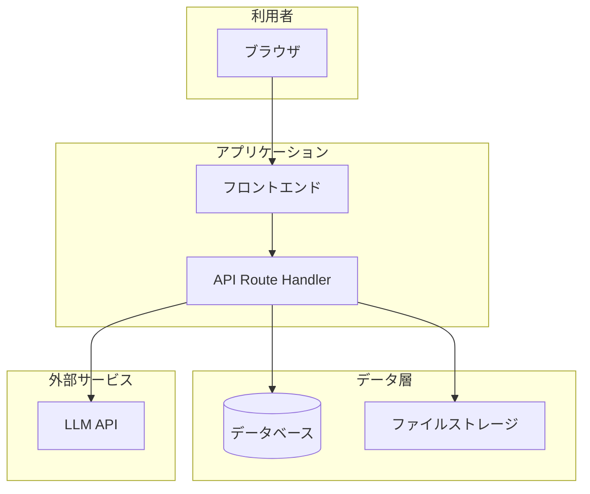
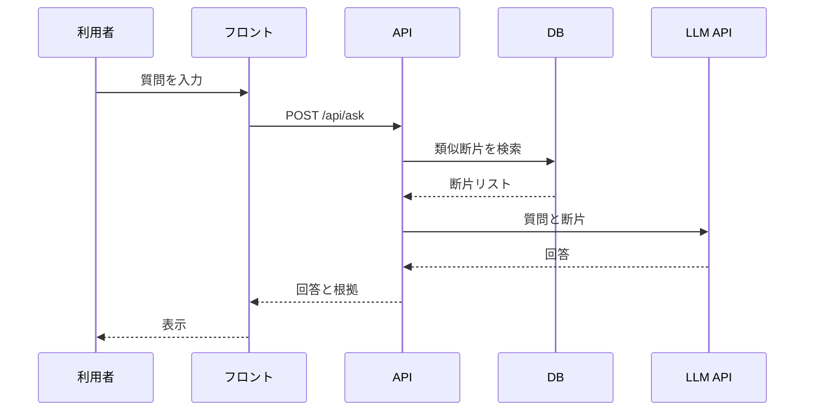

# 要件定義書 ── 〔システム名〕 v0.1

> **このファイルの位置づけ**：要件定義書の**書式テンプレート**です。案件ごとに複製し、〔〕内を埋めて使います。
>
> **関連資料（例）**
>
> - 書き方の要点：[`要件定義書_作成のポイント.md`](./要件定義書_作成のポイント.md)
> - 生の打ち合わせ記録：[`20260708_テックバディ_初回打ち合わせ_トランスクリプト.md`](./20260708_テックバディ_初回打ち合わせ_トランスクリプト.md)
> - 整理済みヒアリング：[`samples/docsearch-app/docs/hearing.md`](../docsearch-app/docs/hearing.md)（記入例）
> - 合否の受け入れ基準：別ファイル `spec.md` に1か所だけ置く（要件定義書と役割を分ける）
>
> ⚠️ **登場する会社・人物・数値はすべて架空です。**実在の団体とは関係ありません（Constitution 第12条）。

| 項目 | 内容 |
| --- | --- |
| クライアント | 〔例：株式会社テックバディ（架空・製造業・社員約300名）〕 |
| 案件名 | 〔例：社内文書検索アシスタント〕 |
| 版 | v0.1（ドラフト） |
| 作成者 | 〔氏名・所属〕 |
| 最終更新 | 〔YYYY-MM-DD〕 |
| 承認 | 〔未承認／承認済み・承認者・日付〕 |

---

## 1. 概要（目的・背景）

### 1-1 背景 ── いま起きていること

〔現状の業務・課題を具体的に書く。数値があれば表にまとめる〕

| 項目 | 現状 | 備考 |
| --- | --- | --- |
| 〔例：探し方〕 | 〔例：共有フォルダ＋Ctrl+F〕 | 〔〕 |
| 〔例：所要時間〕 | 〔例：中央値6分／Slack 待ち22分〕 | 〔実測の有無〕 |

**影響を受けている人・部署：**

- 〔例：総務部、在籍の長いエンジニア〕

### 1-2 目的

**〔このシステムで達成したいことを1文で〕**

> 📌 **曖昧な依頼語（「いい感じに」「便利に」等）をそのまま目的にしない。**ヒアリングで確定した言い換えを書く。

### 1-3 この案件で解かないこと（スコープ外）

| 事象 | 扱い |
| --- | --- |
| 〔例：文書そのものが古い・矛盾している〕 | **解かない。**〔理由〕 |
| 〔〕 | 〔〕 |

---

## 2. ステークホルダー一覧

| 役割 | 氏名／部署 | 関与内容 | 連絡手段 | 備考 |
| --- | --- | --- | --- | --- |
| 発注者・窓口 | 〔例：総務部 部長〕 | 要件の合意、文書選定、役員説明 | 〔メール／Slack〕 | 最終承認者 |
| 利用者代表 | 〔例：情報システム部〕 | 開発ガイド類の提供、技術的な確認 | 〔〕 | 〔〕 |
| 受託側 PM | 〔〕 | 進行管理、合意形成 | 〔〕 | 〔〕 |
| 受託側エンジニア | 〔〕 | 設計・実装・検証 | 〔〕 | 〔〕 |
| 運用担当 | 〔〕 | 初版以降の文書取り込み | 〔〕 | 〔〕 |

---

## 3. 機能要件／非機能要件

### 3-1 機能要件

機能は **F-1, F-2, …** のように番号を振る。各機能は「入力・処理・出力・制約」が第三者に伝わる粒度で書く。

#### F-1 〔機能名〕

| 項目 | 内容 |
| --- | --- |
| 概要 | 〔何ができるか〕 |
| 入力 | 〔ユーザーまたはシステムが渡すもの〕 |
| 処理 | 〔システムが行うこと〕 |
| 出力 | 〔画面・API・保存データなど〕 |
| 制約 | 〔やってはいけないこと、前提〕 |
| 優先度 | Must／Should／Could／Won't |

#### F-2 〔機能名〕

| 項目 | 内容 |
| --- | --- |
| 概要 | 〔〕 |
| 入力 | 〔〕 |
| 処理 | 〔〕 |
| 出力 | 〔〕 |
| 制約 | 〔〕 |
| 優先度 | 〔〕 |

> **初版で入れない機能**は、機能要件の表ではなく **3-3 やらないこと** に書く。

### 3-2 非機能要件

| 区分 | 要件 | 目標値・条件 | 測り方 | 備考 |
| --- | --- | --- | --- | --- |
| 性能 | 〔例：応答時間〕 | 〔例：通常10秒以内〕 | 〔負荷試験／手動計測〕 | 〔〕 |
| 可用性 | 〔〕 | 〔〕 | 〔〕 | 〔〕 |
| セキュリティ | 〔例：API キー〕 | サーバー側のみ保持 | コードレビュー | Constitution 第13条7 |
| コスト | 〔例：LLM 利用料〕 | 〔例：月3,000円以内・上限設定必須〕 | ダッシュボード | 〔〕 |
| 運用 | 〔例：ログ〕 | 本文をログに残さない | ログ設計レビュー | 〔〕 |
| 保守 | 〔例：文書更新〕 | 〔例：手動再取り込みで可〕 | 〔〕 | リアルタイム同期は不要 等 |

### 3-3 やらないこと（初版スコープ外）

| # | 内容 | 理由 | 将来対応 |
| --- | --- | --- | --- |
| 1 | 〔例：Google Drive 自動同期〕 | 認証・OAuth の実装が増える | Phase 以降で検討 |
| 2 | 〔例：ログイン・ロール管理〕 | 社内限定 URL で初版を回す | 〔〕 |

---

## 4. システム構成・外部連携

### 4-1 構成方針

〔モノリス／サーバーレス／BaaS 中心 等、選んだ理由を1〜3文で〕

### 4-2 主要コンポーネント

| レイヤー | コンポーネント | 役割 | 技術・サービス |
| --- | --- | --- | --- |
| フロント | 〔例：Web UI〕 | 質問入力・回答表示・根拠表示 | 〔例：Next.js〕 |
| API | 〔例：Route Handler〕 | 検索・生成のオーケストレーション | 〔例：Vercel Functions〕 |
| データ | 〔例：ベクトル DB〕 | 文書断片の保持・検索 | 〔例：Supabase pgvector〕 |
| 外部 | 〔例：LLM API〕 | 回答生成 | 〔例：Anthropic API〕 |

### 4-3 外部連携一覧

| 連携先 | 送るデータ | 送らないデータ | 合意・説明の要否 | 備考 |
| --- | --- | --- | --- | --- |
| 〔例：Anthropic API〕 | 〔質問文、関連断片〕 | 〔給与・個人情報〕 | 役員説明済み | 〔〕 |
| 〔〕 | 〔〕 | 〔〕 | 〔〕 | 〔〕 |

### 4-4 データの保管場所

| データ | 保存先 | 保持期間 | アクセス制限 |
| --- | --- | --- | --- |
| 〔例：取り込み文書〕 | 〔例：Supabase〕 | 〔〕 | 〔〕 |
| 〔例：利用ログ〕 | 〔例：Vercel Logs〕 | 〔〕 | 本文は記録しない |

---

## 5. システム構成図

> 図は **Mermaid** または `※ここに画像を挿入：…` のマーカーで置く。以下は記入例の骨組みです。

### 5-1 システム全体の構造

**説明：**

- 〔全体を2〜4文で補足する〕

### 5-2 ユーザーとの接点（UI・端末）

| 接点 | 端末・環境 | 操作 | 備考 |
| --- | --- | --- | --- |
| 〔例：質問画面〕 | 社内 PC・ブラウザ | テキスト入力、送信 | スマホは対象外 等 |
| 〔例：管理画面〕 | 〔〕 | 文書アップロード | 〔〕 |

### 5-3 各モジュールの関係

| モジュール | 依存先 | 提供するもの | 備考 |
| --- | --- | --- | --- |
| 〔例：検索モジュール〕 | ベクトル DB | 関連文書断片 | 〔〕 |
| 〔例：回答生成〕 | LLM API、検索結果 | 根拠つき回答 | 〔〕 |

### 5-4 データや処理の流れ

**代表フロー（例：質問に答える）：**

1. ユーザーがブラウザから質問を送信する
2. API が質問をベクトル化し、DB から関連断片を取得する
3. API が断片と質問を LLM に渡し、回答を生成する
4. UI が回答と根拠文書へのリンクを表示する

### 5-5 利用するクラウドサービス・ネットワーク機器

| 種別 | 名称 | 用途 | リージョン／備考 |
| --- | --- | --- | --- |
| PaaS | 〔例：Vercel〕 | ホスティング、Functions | 〔〕 |
| BaaS | 〔例：Supabase〕 | DB、認証（将来） | 〔〕 |
| SaaS | 〔例：Anthropic API〕 | 生成 | 〔〕 |
| ネットワーク | 〔例：社内 VPN〕 | アクセス制限 | 外部公開しない 等 |

---

## 6. スケジュールとマイルストーン

| # | マイルストーン | 目標日 | 成果物・完了条件 | 依存・備考 |
| --- | --- | --- | --- | --- |
| M1 | 要件定義の合意 | 〔YYYY-MM-DD〕 | 本書 v1.0 承認 | ヒアリング完了 |
| M2 | 設計・プロトタイプ | 〔〕 | 構成図、ADR、動く最小版 | M1 |
| M3 | 初版リリース | 〔〕 | 本番デプロイ、運用手順 | 〔例：4月入社前〕 |
| M4 | 検収・引き渡し | 〔〕 | デモ、説明資料、引き継ぎ | M3 |

**リスク・未決事項：**

| 項目 | 状態 | 決定期日 | 担当 |
| --- | --- | --- | --- |
| 〔例：公開 URL の制限方法〕 | 未決 | 〔2回目打合せまで〕 | 〔〕 |

---

## 7. バージョン履歴

| 版 | 日付 | 変更者 | 変更内容 | 承認 |
| --- | --- | --- | --- | --- |
| 0.1 | 〔YYYY-MM-DD〕 | 〔〕 | 初版ドラフト（テンプレートから作成） | ─ |
| 1.0 | 〔〕 | 〔〕 | クライアント承認版 | 〔承認者・日付〕 |

---

## 付録：記入時のチェックリスト

- [ ] 目的は「依頼の言葉」ではなく、ヒアリングで確定した言い換えになっている
- [ ] ステークホルダーに「誰が承認するか」が含まれている
- [ ] 機能要件に **やらないこと** が別表で書かれている
- [ ] 外部送信するデータと送らないデータが一覧になっている
- [ ] 構成図で「ユーザー → UI → API → 外部」の流れが追える
- [ ] マイルストーンに **未決事項の決定期日** が載っている
- [ ] 合否判定に使う受け入れ基準は `spec.md` 等、別ファイルに分離している（重複していない）
