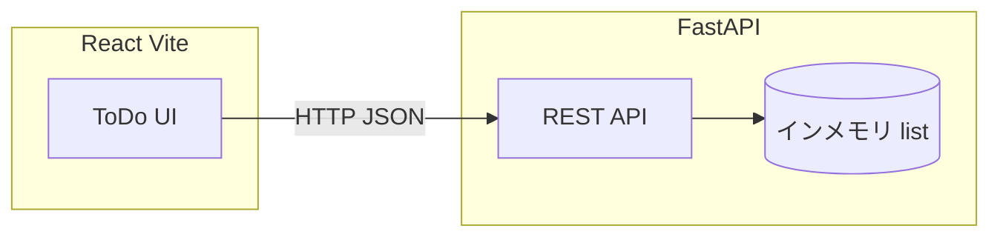
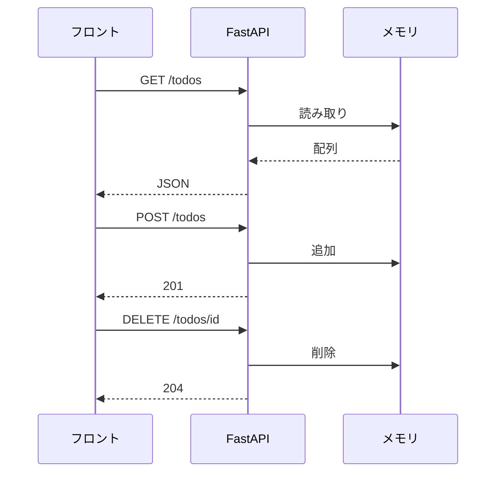
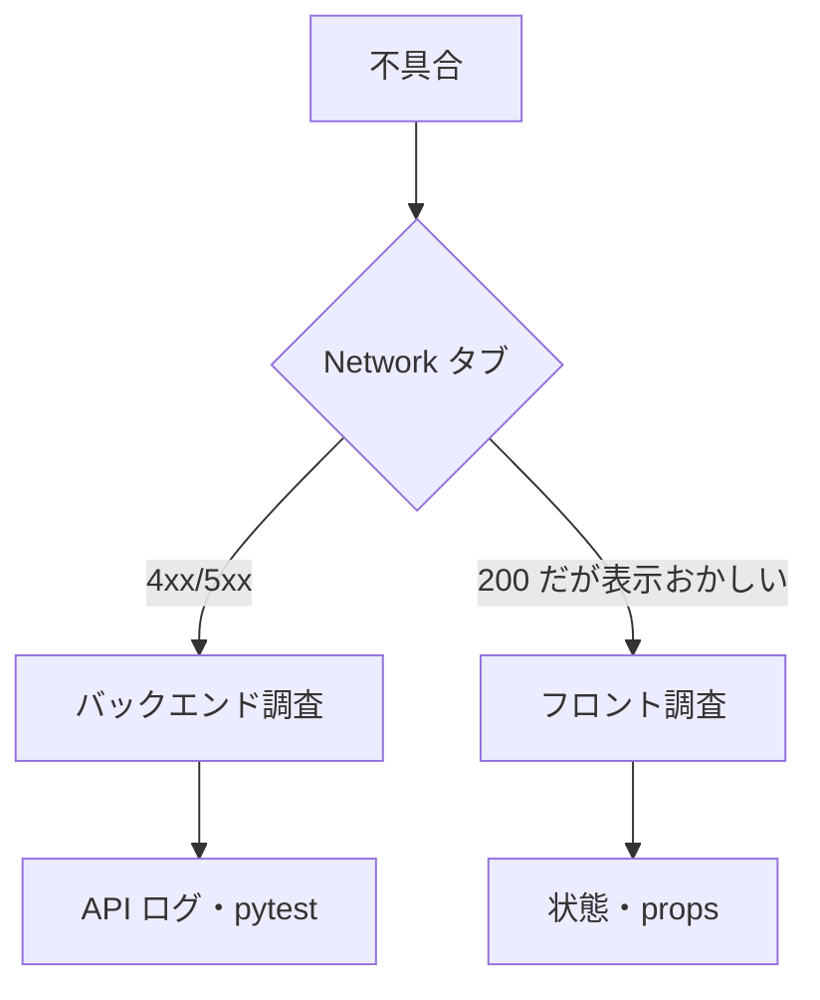
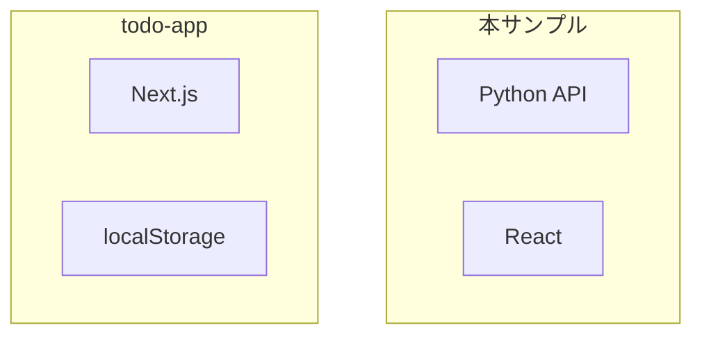
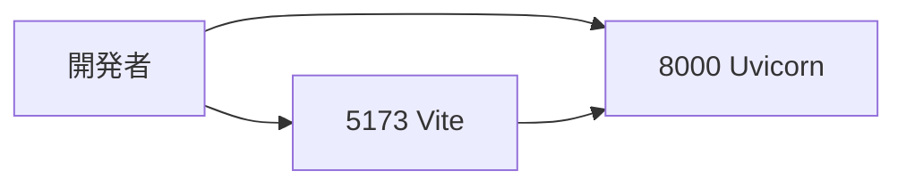

# 要件定義書 ── ToDo アプリ（デバッグ演習・legacy） v1.0

> **この文書の位置づけ**：Ver1 系の**デバッグ演習用**サンプルです。Python（FastAPI）＋ React の最小構成で、API とフロントの切り分けを学ぶ題材です。
>
> 現行教材の主サンプルは [todo-app](../todo-app/) です。本アプリは legacy として残しています。
>
> フォーマットは [`samples/references/要件定義書_フォーマット.md`](../../references/要件定義書_フォーマット.md) に準拠しています。

| 項目 | 内容 |
| --- | --- |
| 版 | v1.0 |
| 最終更新 | 2026-08-09 |

---

## 1. 概要（目的・背景）

### 1-1 目的

ToDo の追加・一覧・削除ができる最小 API と UI を作り、**バグの切り分け（フロント vs バックエンド）**を練習する。

### 1-2 背景

| 項目 | 内容 |
| --- | --- |
| 位置づけ | 欠陥仕込みコード修正（型2評価）の題材 |
| データ保持 | **インメモリ**（再起動で消える） |
| 学習の焦点 | HTTP・JSON・状態管理の基本とデバッグ手順 |

---

## 2. ステークホルダー一覧

| 役割 | 担当 | 関与 |
| --- | --- | --- |
| 教材設計 | 運営チーム | 機能3点・既知の欠陥パターン |
| 学習者 | 受講生 | 欠陥を特定して修正する |

---

## 3. 機能要件／非機能要件

### 3-1 機能要件

| ID | 機能 | 概要 |
| --- | --- | --- |
| F-1 | タスク追加 | POST でテキストを送り、ToDo を1件追加する |
| F-2 | 一覧取得 | GET で全 ToDo を JSON 配列で返す |
| F-3 | 削除 | DELETE で指定 id の ToDo を消す |

**データの形**

```json
{ "id": 1, "text": "string", "done": false }
```

### 3-2 非機能要件

| 区分 | 要件 |
| --- | --- |
| API | FastAPI（Python） |
| フロント | React（Vite） |
| 永続化 | なし（インメモリリスト） |
| CORS | 開発時にフロントから API を呼べること |

### 3-3 やらないこと（スコープ外）

| 項目 | 理由 |
| --- | --- |
| DB・認証 | 演習の複雑さを抑える |
| 完了状態の更新 | 最小3 API に絞る |
| 本番デプロイ | ローカル開発のみ |

---

## 4. システム構成・外部連携

### 4-1 技術スタック

| レイヤー | 選定 |
| --- | --- |
| API | Python 3 + FastAPI |
| フロント | React + Vite |
| 通信 | REST（JSON） |

### 4-2 外部連携

**なし。** ローカルホスト間の HTTP のみ。

---

## 5. システム構成図

### 5-1 全体構成



### 5-2 API 操作



### 5-3 デバッグの切り分け



### 5-4 スコープ外（Phase 1 ver2 との差）



### 5-5 ローカル開発



---

## 6. スケジュールとマイルストーン

| マイルストーン | 内容 |
| --- | --- |
| M1 環境起動 | API とフロントを両方起動 |
| M2 正常系確認 | F-1〜F-3 が通ることを確認 |
| M3 欠陥修正 | 仕込みバグを特定・修正（型2演習） |

---

## 7. バージョン履歴

| 版 | 日付 | 変更内容 | 担当 |
| --- | --- | --- | --- |
| v1.0 | 2026-08-09 | 要件定義書フォーマットに準拠して再構成 | 教材チーム |

---

## 関連文書

| 文書 | 内容 |
| --- | --- |
| [../todo-app/docs/requirements.md](../todo-app/docs/requirements.md) | Ver2 Phase 1 の現行題材 |
