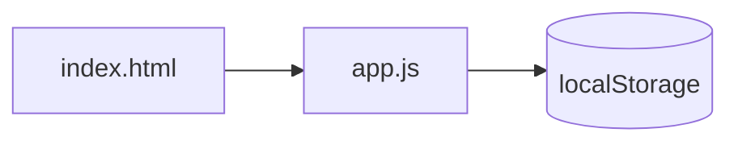
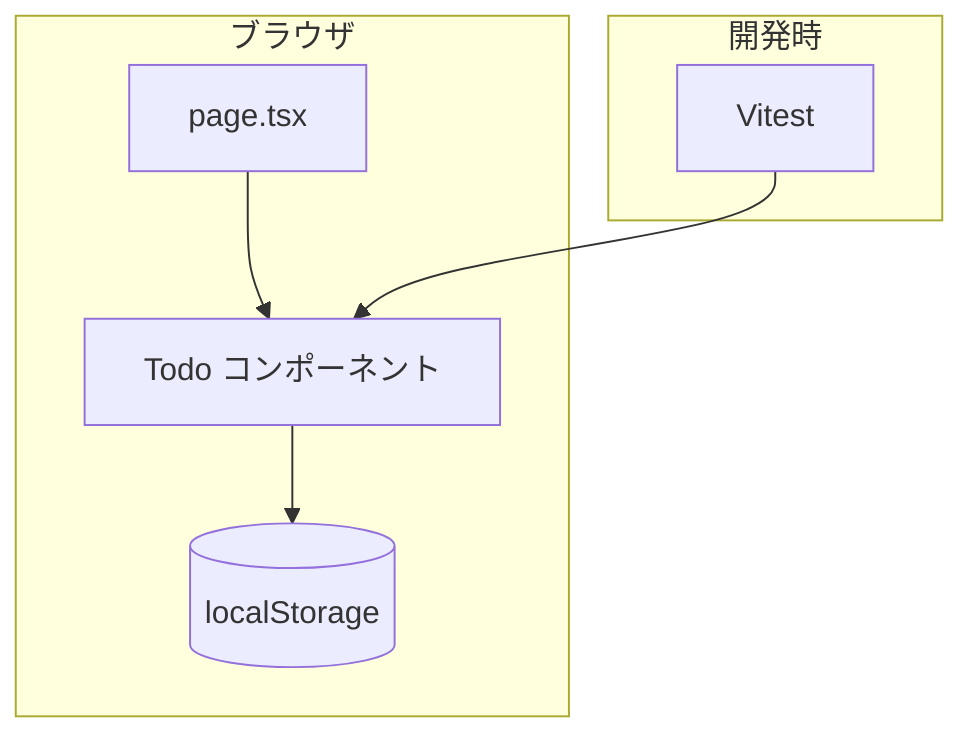
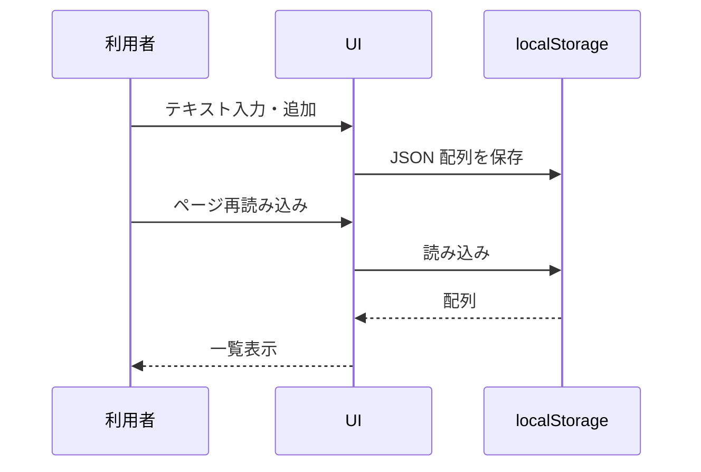
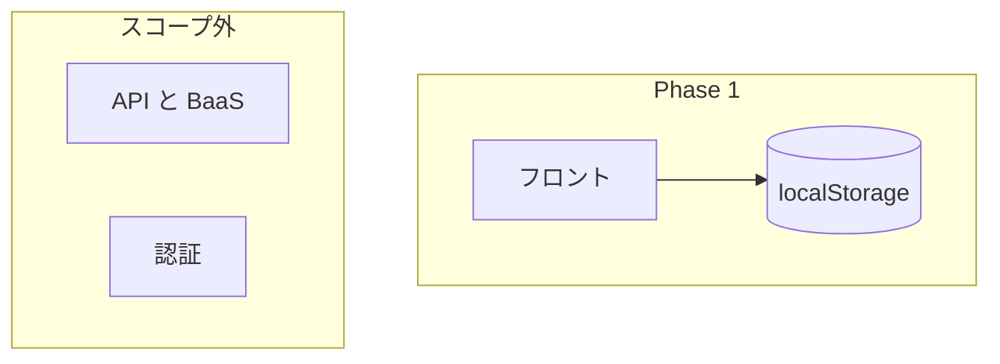
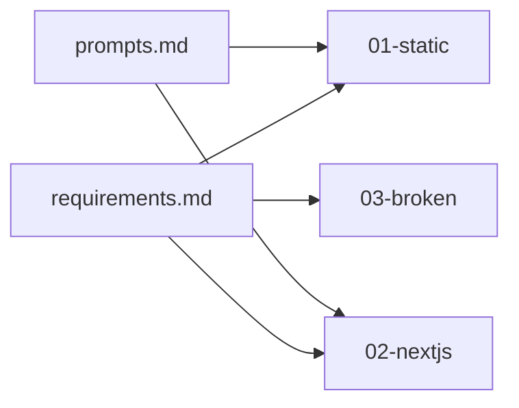

# 要件定義書 ── ToDo アプリ（Phase 1 教材） v1.0

> **この文書の位置づけ**：Ver2 Phase 1「小さなアプリを作る」の教材題材です。受託案件ではなく、**Vibe Coding で作って壊れ方を体験する**ための要件です。
>
> フォーマットは [`samples/references/要件定義書_フォーマット.md`](../../references/要件定義書_フォーマット.md) に準拠しています（ステークホルダー・スケジュールは教材向けに簡略化）。

| 項目 | 内容 |
| --- | --- |
| 版 | v1.0 |
| 最終更新 | 2026-08-09 |
| 対応節 | `1-1-1`・`1-2-6`・`1-2-7`・`1-2-8` |

---

## 1. 概要（目的・背景）

### 1-1 目的

最小限の ToDo 管理ができるアプリを作り、**AI 支援での実装→デバッグ→テスト**の一連を体験する。

### 1-2 背景

| 項目 | 内容 |
| --- | --- |
| 位置づけ | Phase 1 の到達点サンプル（模範解答というより**同じ手順で辿り着ける完成形**） |
| 学習の焦点 | フレームワークの作法より、**どこで壊れるか**を知ること |
| 成果物 | 静的版（HTML/CSS/JS）と Next.js 版の2系統 |

---

## 2. ステークホルダー一覧

| 役割 | 担当 | 関与 |
| --- | --- | --- |
| 教材設計 | 運営チーム | 機能5点・スコープ外の定義 |
| 学習者 | 受講生 | 同要件で自分の版を作る |
| 参照実装 | 本リポジトリの `samples/todo-app/` | 節本文から参照 |

---

## 3. 機能要件／非機能要件

> 受け入れ基準の詳細は各節の演習・テストで扱う。ここでは機能の一覧を置く。

### 3-1 機能要件

| ID | 機能 | 概要 |
| --- | --- | --- |
| F-1 | タスク追加 | テキストを入力して ToDo を追加する |
| F-2 | 一覧表示 | 追加した ToDo を一覧表示する |
| F-3 | 完了切替 | チェックで完了／未完了を切り替える |
| F-4 | 削除 | 1件ずつ削除できる |
| F-5 | 永続化 | ブラウザの localStorage に保存し、再読み込み後も残る |

**データの形（共通）**

```json
{ "id": "string", "text": "string", "done": false }
```

### 3-2 非機能要件

| 区分 | 要件 |
| --- | --- |
| 実行環境 | 静的版はブラウザのみ。Next.js 版は Node 20.9 以上 |
| 依存 | 外部 API・ログイン・DB は使わない |
| テスト | Next.js 版は Vitest で主要ロジックを検証 |
| 教材整合 | `03-broken/` に意図的な欠陥3点を仕込み、デバッグ演習に使う |

### 3-3 やらないこと（スコープ外）

| 項目 | 理由 |
| --- | --- |
| ユーザー認証 | Phase 1 の学習範囲外 |
| サーバー同期・共有 | localStorage のみで足りる |
| 期限・優先度・カテゴリ | 最小機能に絞る |
| 本番デプロイ・CI | Phase 1 では触れない（Phase 2 以降） |

---

## 4. システム構成・外部連携

### 4-1 構成バリエーション

| 版 | パス | 構成 |
| --- | --- | --- |
| 静的版 | `01-static/` | HTML + CSS + JavaScript。`localStorage` |
| 演習解答 | `01-static-solution/` | 静的版＋絞り込み |
| Next.js 版 | `02-nextjs/` | App Router + React + Vitest |
| 欠陥版 | `03-broken/` | Next.js 版に欠陥3点（`DEFECTS.md` は解答） |

### 4-2 外部連携

**なし。** ブラウザ内完結。ネットワーク通信は Phase 2 以降で扱う。

---

## 5. システム構成図

### 5-1 静的版



### 5-2 Next.js 版



### 5-3 データの流れ（追加）



### 5-4 Phase 1 で触れない層



### 5-5 教材ディレクトリ関係



---

## 6. スケジュールとマイルストーン

| マイルストーン | 対応節 | 内容 |
| --- | --- | --- |
| M1 Vibe Coding | `1-1-1` | 10分で静的版を作る |
| M2 フレームワーク版 | `1-2-6` | Next.js に置き換え |
| M3 デバッグ | `1-2-7` | `03-broken` で欠陥を直す |
| M4 テスト | `1-2-8` | Vitest で id 衝突等を検出 |

---

## 7. バージョン履歴

| 版 | 日付 | 変更内容 | 担当 |
| --- | --- | --- | --- |
| v1.0 | 2026-08-09 | 要件定義書フォーマットに準拠して再構成 | 教材チーム |

---

## 関連文書

| 文書 | 内容 |
| --- | --- |
| [prompts.md](./prompts.md) | Claude Code 用プロンプト |
| [../README.md](../README.md) | ディレクトリ構成・検証記録 |
